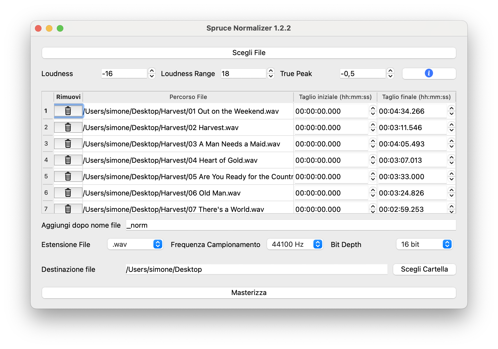

# Spruce Normalizer

**Spruce Normalizer** is a simple and effective application for normalizing the volume of `.mp3` and `.wav` audio files.  
It features a graphical interface built with **PyQt6** and is designed to make audio normalization easy and accessible for everyone.

Whether you're working on podcasts, music, or voice recordings, Spruce Normalizer helps you achieve a consistent and well-balanced output ready for sharing or publishing.

---

## What it does

Spruce Normalizer adjusts the loudness of multiple audio files so they play back at the **same perceived volume**.

It uses **LUFS** (Loudness Units relative to Full Scale), **LRA** (Loudness Range), and **True Peak** values to match audio levels between different files.

---

## Features

- Intuitive graphical interface (PyQt6)
- Supports `.mp3` and `.wav` audio formats
- Handles multiple files at once
- Built-in FFmpeg — no need to install anything separately
- Minimal setup: just load your files and click

---

## Requirements

- Python **3.9+**

> The app includes a copy of **FFmpeg** internally, so there's no need to install it on your system.

---

## Screenshot

Here’s a preview of the graphical interface:

---

## License

This project is licensed under the terms of the **GNU General Public License v3.0 (GPLv3)**.  
You are free to use, modify, and distribute it under the conditions of the license.

---

## Author

**Simone De Angelis**
